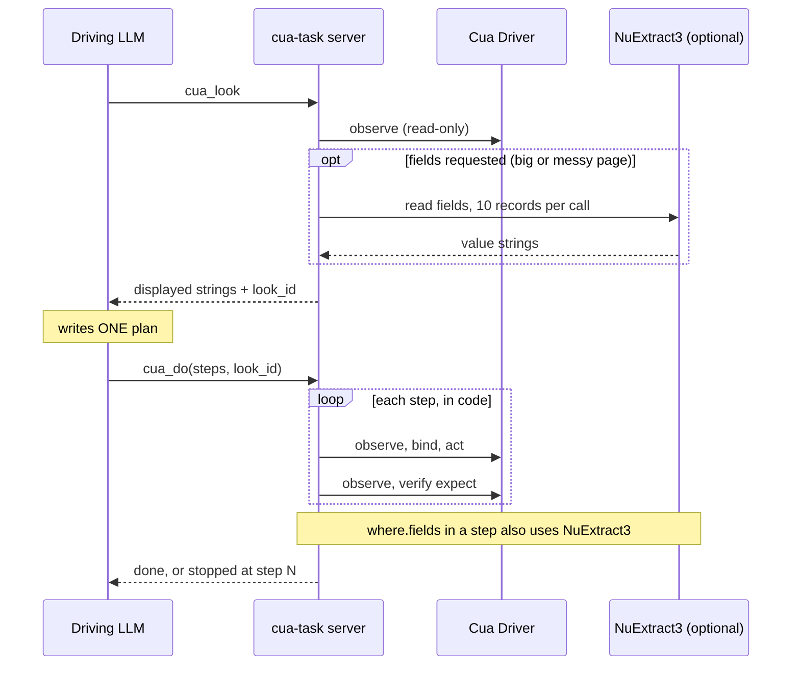

# Computer-use capability dispatch

**Current default profile:** `local-mac` selects Julia-1 for local finite choices and refuses hosted fallback. The `fleet` profile retains NuExtract3/Jev/Qwen and configured screenshot services. See [provider profiles](docs/PROVIDERS.md#provider-profiles) and the [local Mac support status](docs/LOCAL-MAC.md).

A companion to stock computer-use tools and skills. The stock driver observes and executes; this repository supplies typed request guidance, capability routing, evidence matching, bounded semantic recovery, and a CESS simulation loop.

The driving LLM describes intent and evidence requirements. Dispatcher code follows the sketch to choose providers. Models return evidence or an offered ID; the controller retains executable arguments, validates the current binding, and independently verifies progress.

## Multiple models, one request

The stock driver supplies current controls. The driving LLM describes the request and required evidence. **Dispatcher code chooses the route**, using rules in the CESS sketch; the skill teaches the LLM how to construct that request. There is no trained router in this version.

| Request / model | What the provider receives | What happens afterward | Current status |
|---|---|---|---|
| Exact control / no model | Unique current role/name or ID | Validate and bind the control | Implemented |
| Simple entities / GLiNER | Record text and simple entity labels | Match extracted values against explicit criteria | Contract tested; live adapter needs qualification |
| Described fields / GLiNER2 | Per-record text, field descriptions and types | Normalize, compare within the same record, apply caller ordering | Live span adapter and measured examples |
| Structured, relational or multilingual extraction / GLiNER2.5 | Scoped text and requested schema | Preserve grouping/relations before matching | Provisional routes; structured adapters need qualification |
| Bounded classification / Decide | Evidence and described categories | Map accepted class to a caller-authorized action | Contract tested; live adapter needs qualification |
| Semantic choice or recovery / Julia-1 (local-mac) or Jev (fleet) | Goal, current candidate descriptions, constraints and available evidence | Select an offered ID or defer | Live adapters |
| Escalation / Qwen (fleet only) | Goal and offered candidates via the bounded selector | Handle weak/failed Jev choices; verify after action | Existing selector integration |

For example: the LLM requests provider name, appointment duration and start time, with explicit predicates and ordering. GLiNER2 extracts those fields; code selects the matching record. If an extracted name has an uncertain boundary, the configured generic chooser can recheck it. A selected ID never supplies arbitrary executable arguments. The driver executes the stored current binding and observes the result independently.

CESS preserves the sketch, accepted counterexamples and executable regression checks. A failure either calls for repairing code to existing policy or proposing a policy change. Tests alone do not authorize a new rule.

## Current approach: look, then plan once, execute in code

The driving LLM does not mediate every hop. Measured live, tool time was about 13% of a run and LLM turns about 87%, so the default path minimizes turns and keeps recovery in deterministic code (design: [docs/PLAN-B.md](docs/PLAN-B.md), CE-FACADE-005).

1. `cua_look`: read-only, no model. Returns the page's displayed strings (records, controls, dialogs, canvas texts) and a `look_id`.
2. `cua_do` with `steps`: the LLM sends ONE small plan from what it saw. The server validates the whole plan, then per step re-observes, binds, acts, verifies `expect`, and recovers from stale state itself (bounded; a click is never retried).
3. Waits for the page, in code: a look at a page that is not ready (no snapshot, empty or degraded tree, or a thin web area such as a loading page or any site's "checking your browser" holding page) is re-observed after 0.5 s, then 1 s, and then returned as it is. The rule is structural, with no site or phrase list, applies only to looks (never to the observations around an action), and never solves or bypasses a check. LLMs facing a blank or holding page tend to give up and report it unreadable (both arms did in our real-retailer runs); the deterministic path just looks again. It is verified offline; a live run has not yet exercised it because the pages were ready.
4. Guardrails in code: a filter is only allowed against a look the server issued (`look_id`); incomparable values are `unknown`, not a guess; destructive controls and dialogs need explicit, exact authorization; the whole plan has a hard time budget.



Full version (NuExtract, staleness and recovery): [docs/PLAN-B.md#sequence](docs/PLAN-B.md#sequence).

NuExtract3 is opt-in for big or messy pages; there is no fast-model loop choosing steps. The primitive tools (`cua_observe`, `cua_choose`, `cua_act`, ...) are hidden unless `CUA_TASK_ADVANCED=1`. The agent tool of option D is experimental and not merged.

**Evidence so far (n=1 per cell, Sonnet 5.5, real Chrome, directional only):** on 3 tasks the stack used about 2.5x less cost than native Cua Driver tools ($0.90 vs $2.69 total) with the same accuracy: booking and ax_dup correct on both arms, no wrong clicks; canvas_regions failed on both arms (click unverifiable). Turns and wall time were about equal. Method and preregistered rules: [experiments/facade-vs-native](experiments/facade-vs-native/PREREGISTRATION.md).

**Minimal check (offline, no desktop, no GPU):**

```sh
scripts/setup_facade.sh --no-perception
.venv-facade/bin/python -m unittest discover -s facade -p 'test_*.py'   # 559 tests
.venv-facade/bin/python scripts/check_call_budget.py
python3 inference/cua-decider/capability-dispatch/simulation_gate.py
```

## Agent-facing task tools

Register the local [CUA task MCP facade](docs/FACADE.md) to expose observation, NuExtract reading, Jev/Julia/GLiNER2 selection, bound action and verification directly to agents. `scripts/setup_facade.sh` also installs the pinned [Cua Perception](docs/FACADE.md#cua-perception-screenshot-regions) extension by default for on-device screenshot regions (`--no-perception` to skip). See the [fresh-agent adoption evidence and limitations](docs/FACADE-ADOPTION.md).

## Install the skill

This repository is public. Clone it over HTTPS or SSH, then:

```sh
npx skills add open-horizon-labs/computer-use --skill cua-capability-dispatch
```

For global Codex use, append `--agent codex --global`. The [skills CLI](https://github.com/vercel-labs/skills) installs the skill's **[setup reference](skills/cua-capability-dispatch/references/setup.md)** and bundled sketch. It installs guidance, not model environments or a running dispatcher.

## Set up the runtime

```sh
gh repo clone open-horizon-labs/computer-use
cd computer-use
export CUA_CAPABILITY_ROOT="$PWD"
python3 inference/cua-decider/capability-dispatch/simulation_gate.py
```

The offline check needs only Python 3.10+. For real inference, choose a profile and configure its local or hosted workers in `~/.config/computer-use/runtime.json`; see the [setup reference](skills/cua-capability-dispatch/references/setup.md). Installing the skill does not install model environments or modify the standalone Fleet selector.

## Alternative Jev API and endpoint setup

Get a TypeSafe API key through your [TypeSafe account](https://console.typesafe.ai) or administrator. Configure it separately from the Qwen fallback:

```sh
export TYPESAFE_API_KEY_FILE="$HOME/.config/computer-use/jev-api-key"
export TYPESAFE_BASE_URL='https://api.typesafe.ai'
export TYPESAFE_DEFAULT_MODEL='jev-latest'
```

The file must already contain your key. `TYPESAFE_API_KEY` is the direct-environment alternative. Jev's SDK calls `https://api.typesafe.ai/v1/systemone`; the base URL has **no `/v1` suffix**. Qwen instead uses `QWEN_BASE_URL` **with `/v1`**, plus its own `QWEN_API_KEY` or `QWEN_API_KEY_FILE`. Both providers need configuration for the cascade.

See [full key/endpoint setup and Jev-only smoke check](skills/cua-capability-dispatch/references/setup.md#jev-api-key-endpoint-and-model), including secret-file precedence and optional Fleet retrieval. Installing the skill does not create API accounts or credentials.

## Start here

- [Custom skill](skills/cua-capability-dispatch/SKILL.md): request construction and safe integration with stock tools.
- [Sketch S](inference/cua-decider/capability-dispatch/SKETCH.md): authorized routing and matching policy, including approved boundary recheck.
- [Counterexamples A](inference/cua-decider/capability-dispatch/COUNTEREXAMPLES.json): accepted failures and their authority.
- [Projection P](inference/cua-decider/capability-dispatch/dispatch.py): dispatch, matching, recovery and binding.
- [Decide precision experiments](experiments/decide-precision-2026-09-27/RESULTS.md): six epochs, label descriptions and reviewed hard negatives, with a paired Jev control.
- [Gradual specialist rollout](docs/SPECIALIST-ROLLOUT.md): shadow Jev, qualify a task contract, then propose selective takeover.
- [Salvage](docs/SALVAGE.md): what to retain, mistakes to avoid, next experiments.
- [Evidence](inference/cua-decider/capability-dispatch/simulation/JEV-COMPARISON.md): bounded comparison, not a general CUA benchmark.

## Offline validation

Python 3.10+; no models, credentials, GPU, browser or third-party packages needed:

```sh
python3 inference/cua-decider/capability-dispatch/simulation_gate.py
python3 -m unittest discover -s inference/cua-decider -p 'test_*.py'
```

The facade, its call-budget guardrail and the live scorer's tests need the facade requirements (`scripts/setup_facade.sh`, or `pip install -r facade/requirements.txt`); CI runs all of these on every pull request (`.github/workflows/offline-gates.yml`):

```sh
python3 -m unittest discover -s facade -p 'test_*.py'
(cd inference/cua-decider/capability-dispatch && python3 -m unittest test_dispatch)
python3 -m unittest discover -s scripts -p 'test_*.py'
python3 -m unittest discover -s experiments/facade-vs-native -p 'test_*.py'
python3 scripts/sync_skill_references.py --check
.venv-facade/bin/python facade/check_protocol.py
.venv-facade/bin/python scripts/check_call_budget.py   # table of scenario, calls, budget, PASS/FAIL; nonzero on failure
```

`scripts/check_call_budget.py` enforces [facade/CALL_BUDGET.json](facade/CALL_BUDGET.json): the default path (look, then do: `cua_look` and `cua_do`, the only tools visible unless `CUA_TASK_ADVANCED=1`) stays within its measured LLM-visible calls on the real captured Chrome trees and synthetic wizard, 100-row and canvas shapes; `scripts/check_plan_mutations.py` proves the wrong patches fail by assertion and `scripts/look_compare.py` reports the structure of the look claim (live latency and accuracy are not measured), because the driving LLM's turns were 87% of agent wall time. Adding a tool or a mandatory step to the default path requires a CE and a CALL_BUDGET.json change; see [FACADE.md](docs/FACADE.md#call-budget) and, for look-then-plan, [PLAN-B.md](docs/PLAN-B.md).

The simulation gate checks 28 scenarios, 40 metamorphic variants, 20 unit/contract tests, 35 recorded decisions and seven deliberately wrong repairs. It writes results into the simulation directory. Exact-output checks and capable-model sketch review are separate; retained review is a historical self-review, not fresh independent certification.

## Integration

The installed skill is self-contained guidance; keep a separate runtime checkout for execution. Its bundled sketch is synchronized with `python3 scripts/sync_skill_references.py`; `--check` detects drift. It supplements the stock skill and does not install or replace the driver.

The Python interface is `Engine(providers).decide(request, current_snapshot)`, followed by `execute_bound(request, selection, fresh_snapshot, execute_callback)` only when authorized. `execute_callback` is the stock driver's operation adapter. Observe again to verify the intended postcondition. See the [request example](inference/cua-decider/capability-dispatch/booking-request.json) and [controlled caller examples](inference/cua-decider/capability-dispatch/simulation.py). This is currently a Python component, not a deployed HTTP API.

The CESS strangler wrapper is `Strangler.from_config(providers)`. It retains the qualified GLiNER2 rollout in [ROLLOUT.json](inference/cua-decider/capability-dispatch/ROLLOUT.json). Supply `generic_from_config()` in the compatibility slot `incumbent_jev`; the selected generic implementation comes from the active profile. The slot name does not establish model attribution. `Strangler` never executes; continue to bind current Driver arguments with `execute_bound` and independently verify effects.

Providers are injected callables `(step, request) -> grounded evidence or offered choice`. The included live adapters cover NuExtract page records, Julia finite choice, GLiNER2 spans, SystemOne screenshots, and the Jev→Qwen selector. The default local profile does not yet provide local NuExtract or visual workers. Original GLiNER, structured GLiNER2.5 and Decide routes have controlled contract coverage but require qualified live adapters for their respective roles. The span adapter's GLiNER2.5 option is not a structured-record/relationship adapter.

## Live inference configuration

[Provider setup](docs/PROVIDERS.md) explains explicit worker and selector commands. Live inference and live desktop testing are separate from the offline gate. No services are started by the gate.

Historical files retain their original experiment paths, local hardware descriptions, and pre-approval wording where relevant. S4.4 and the accepted archive carry current policy. The original `inference/` layout is retained so captured replays remain resolvable without the homelab repository. Only required fixture code and evidence were extracted; training datasets, deployment infrastructure and credentials stay outside this repo.

No upstream license is inferred for third-party tools or model weights; they remain external dependencies under their own terms.

## Terminal observations and chooser preference

[Terminal integration](docs/TERMINALS.md) combines fresh Driver screenshots and AX observations with explicit quality metadata and a bounded visual postcondition check. An unchanged AX tree is not a stall. These are integration helpers; the stock Driver binary is unchanged.

Julia-1 is the local profile's generic chooser; [Jev](docs/PROVIDERS.md#jev) and its Qwen escalation are available in the opt-in `fleet` profile. GLiNER2 extraction and current-snapshot binding are preserved. Julia is not a page reader or vision model.
