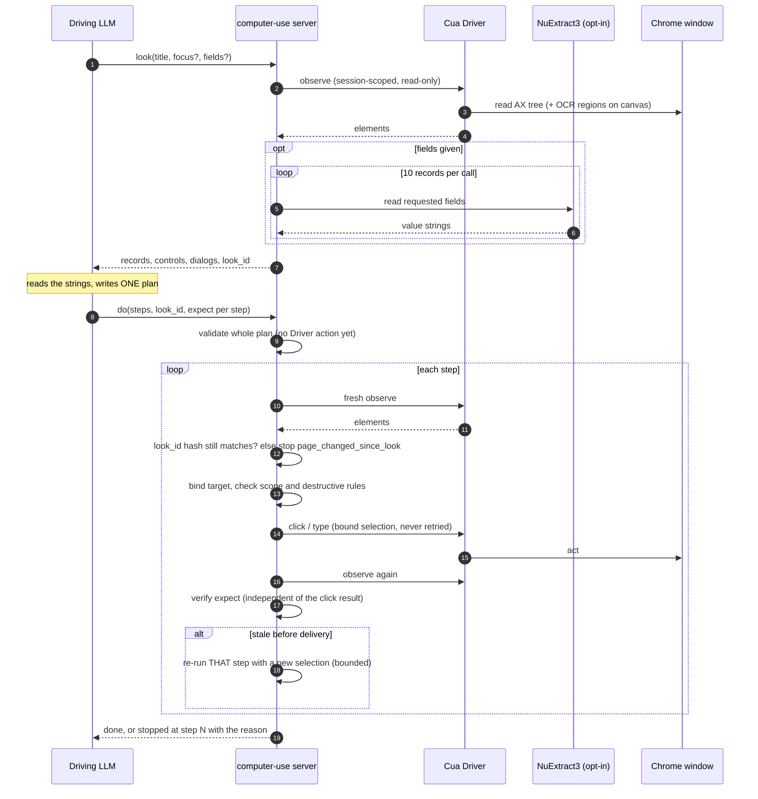

# Option B: look, then plan once (CE-FACADE-005, proposed)

Status: implemented on branch `plan-b`, offline only. Proposed CE, pending user approval. **Nothing here has run against a live desktop and the central claim (below) is not verified.**

## The decision

The user approved this shape from the solution-space review: the LLM SEES the page's strings once (`look`: deterministic, no model by default), then sends ONE small plan (`do` with `steps`), and the server executes it deterministically with per-step rebinding and recovery. NuExtract3 is the only model on the common path, and only where a plan says so (`where.fields`) or a look asks for it (`fields`): it is an opt-in field extractor for big or messy pages, never the default look. No Qwen or fast-model loop chooses steps.

## Why (the evidence, n=1 per cell)

Measured live (Sonnet 5.5, real Chrome): the single-tool `do` cut turns from 6-7 to 3-5 and cost 4-6x, but the LLM wrote its filter BLIND (`duration contains "30"`), the correct slot's duration was displayed as "half-hour", and `do` booked a decoy and reported done. Option D (a fast model choosing every step) failed for a different reason and costs 1 to 3 s per step. Blind filters are the failure class: the fix is sight, then a plan, not a smarter chooser.

## Sequence



## Design

```
look(title, focus?, max_records?, max_bytes?, fields?)      read-only, no model by default
   -> records (displayed lines), page text, controls, dialogs, canvas texts, counts, truncated, look_id
do(goal, expect=null, title, look_id?, steps=[...], abort_if?)
   validate the WHOLE plan (no Driver action yet)
   for each step: fresh observation -> discovery -> where -> bind -> act (scope revalidation) -> verify(expect)
   stop at the first step that is not done
```

Code: `computer_use/look.py` (structure of one observation into displayed strings, `Facade.look`), `computer_use/plan.py` (validation, the lines-where stage, the executor, hints), and small hooks in `Facade._do` (`plan=` channel: lines-where, explicit confirm step, destructive check on the resolved control, per-step window pinning). The single-step form does not go through the plan executor and is byte-for-byte the previous behavior; `Facade.subtree` gained a per-observation child map (same closure, no longer quadratic: a 100-row page took 0.9 s per look before).

### `look_id`: no filter without sight

`look_id` is a short hash of the window title, the page's headings, every page control's state and the ORDERED FULL lines (untruncated, every line) of the displayed records (after `focus`, `max_records` and `max_bytes`); text hidden past the display cut therefore invalidates it, and a lone toast does not. The server remembers the issued ids of this session per (pid, window_id, hash), with the focus terms and how many records were displayed. A `where.lines` step is allowed only with an id the server issued for this window. At the step the executor recomputes the displayed record lines on the CURRENT observation with the same parameters and compares the hash: a mismatch defers `page_changed_since_look` before any click, and the response deliberately carries no fresh id (the LLM has not seen those lines). Only records the look displayed are candidates. Conditions are evaluated on the displayed (cut) lines, exactly what the LLM saw, and a cut is NOT harmless: a hidden line can contradict a shown positive match. Uniqueness is decided over ALL records of the fresh observation; selecting a record with cut or omitted lines needs `accept_hidden_text`; negative conditions over such records are refused; `look` takes `max_lines` and `line_chars` to show whole records.

## Guarantees

Preserved (each has its existing tests, plus the plan tests named in the CE):

| guarantee | how plans keep it |
|---|---|
| bound, single-use selections; scope revalidation at act | every step calls the same `choose`/`issue`/`act`; nothing is shared between steps |
| a click is never retried; no selection after a delivered click | the executor never re-runs a step that delivered; `_do` unchanged; test with a failing click counts exactly one click |
| stale recovery (S4.2 s7) | a stale refusal re-runs THAT step on a fresh observation with a NEW selection; a mid-plan page that keeps changing stops at that step (`ui_changed_repeatedly`) |
| hard 3x budget | plan-level: no step starts after 3x `budget_s`; each step gets `min(budget_s, remaining/3)` |
| confirm is opt-in by exact label and a declared dialog | an explicit `confirm` step only, directly after a press; exact label; exactly one such control inside the dialog the previous step opened; the caller's `dialog_text` must equal the dialog's actual text lines as a set (POSITIVE AUTHORIZATION: no negation or verb word list decides intent), plus the identity strings as whole tokens as a sanity check |
| incomparable -> unknown; `treat_as_match`/`accept_unknown` gates; `excluded_values` | `where.fields` runs the unchanged reader path |
| answer-leak guard | plan goal and every step goal, before any Driver call |
| destructive-verb guard (option D) | literal `control`/`confirm` at validation, and the RESOLVED control at execution; only the step's own `allow_destructive` (exact label) unlocks it, never goal text |
| required `expect`; text-bearing non-control nodes only | non-null on every press/type/confirm step, null only on the last step (ends `delivered_unverified`) |
| S4.8 strings; no window moves; OCR never feeds typed values | look values are displayed strings; the look never moves or clicks; canvas texts are only listed as `control`/`near` candidates |
| primitives hidden unless `CUA_TASK_ADVANCED=1`; D untouched | test on the live `list_tools`; no primitive is ever named in a plan hint |

New: whole-plan validation before any Driver action; `look_id`; `page_changed_since_look`; a look that never truncates silently; one match or a stop (the chooser is never asked to break a `where.lines` tie).

## What NuExtract is for

- `look(fields=...)`: values per displayed record, in chunks of 10 records per reader call (the extractor has a 20 s whole-call deadline, so 100 rows are never one call). Opt-in.
- `where.fields` (+ `predicates`): exactly the previous `do records` path (one read of the discovered records, the shape guard, unknown handling).
- Nothing else. The default look and `where.lines` never start the reader (tests fail the build if they do).

## Conservative choices (each is policy the user may want to decide)

1. `expect` at the top level of a plan must be null (each step has its own); a non-null one is refused rather than guessed as the last step's.
2. A press step needs `where` and/or `control`: no plan step ever falls through to the chooser on "the page's controls".
3. Several `where.lines` matches stop (`where_matches_several`) instead of asking the chooser or clicking the first.
4. A `confirm` step must directly follow a `press`; a dialog that was already open is not confirmable by a plan.
5. A confirm step declares the dialog's COMPLETE text (second review): the negation word list was deleted because word lists cannot be complete; the whitelist decides. Cost: press, defer with the actual lines, deliberate press (3 calls; 2 when the wording is known). The destructive-label list (widened) is a floor, not a definition.
5b. Third review: `dialog_controls` is required beside `dialog_text`; the dialog region is compared in full; records show tagged image/group/field/state lines and unrepresentable text counts as hidden; look_id is structural.
5a. Where.lines uniqueness covers all records; hidden-text selection needs `accept_hidden_text`; control state is in the `look_id`; toggles need a look; every response is marked untrusted.
6. The default identity of a `where.lines` press is the values its `eq`/`contains` conditions required; if the dialog does not show all of them, the confirm step stops (measured: 3 calls instead of 2).
7. Conditions are evaluated on the DISPLAYED (cut) lines; values are at most 60 characters.
8. Destructive controls (delete, remove, erase, discard, reset, sign out, cancel subscription) need `allow_destructive: <exact label>` on the step itself; goal text never unlocks one (review of PR 18: "do NOT delete anything" unlocked it).
8a. Plan steps match `control` exactly; prefix only with `control_match: "prefix"`. Negative line conditions over cut or omitted lines are refused. Identity strings are whole tokens and a negated identity line stops the confirm. `look_id` covers title, headings and full lines. Every look says its page text is untrusted data.
9. `where.lines` after a step that changed the page stops `page_changed_since_look` (never re-anchors on a new look it has not seen).
10. `budget_s` defaults to 20 as in the single-step form, so the plan hard cap is 60 s; a long plan needs a larger `budget_s`.
11. `live_task_budgets.booking` rises from 1 to 2 because the default path is now look then do.
12. Two extra plan statuses beyond done|stopped|aborted|refused|failed, reusing existing ones: `delivered_unverified` (last step without `expect`) and `observed` (a verify-only plan).

## The question, and what remains (UNMEASURED live)

The question: does a deterministic look suffice on a 100-row page, so that NuExtract stays out of the default look unless it wins? UNMEASURED live.

`scripts/look_compare.py` builds a synthetic 100-row `invoices` page (rows with several fields and near-duplicates, shaped like the eval suite's task) and runs the deterministic look, the look with `fields`, and the plan a scripted LLM writes from each. Offline result (fake reader; it says only that a policy that already knows the target can act on the data):

```
variant                           bytes     shown calls  chunks  plan target
deterministic, default caps        4810   40/100      0       0  none (the target record is not among the 40 shown)
deterministic, all 100 rows       11065  100/100      0       0  done, clicked INV-063 -> CORRECT
deterministic, focus=Northwind     1171    6/100      0       0  done, clicked INV-063 -> CORRECT
fields, all 100 rows              19601  100/100     10      10  done, clicked INV-063 -> CORRECT
fields, focus=Northwind            1799    6/100      1       1  done, clicked INV-063 -> CORRECT
```

What this shows, and only this: a policy that already knows the target can act on the data. The deterministic look contains every string that policy needs; on 100 rows the default caps show 40, so the LLM needs `focus` (or `max_records` and `max_bytes` raised: 11 KB) to see the target, and `fields` adds a response of 19.6 KB and 10 reader calls for values that repeat the displayed lines. **Offline numbers are structure and size only**: the fake reader is exact by construction and instant. What remains, to be measured live: (1) the wall time of `look(fields=...)` on 100 rows (10 reader calls; `look` sends 10 records per reader call (`EXTRACT_CHUNK`, computer_use/look.py:26), each call under the extractor's 20 s deadline); (2) NuExtract accuracy on those records against the displayed strings (`--reader package.module:callable` runs the same record texts through a real reader and scores them); (3) whether an LLM writes correct plans from the deterministic look alone on messy pages, and the wrong-click rate against native. Until then the question stays open and NuExtract stays out of the default look.

## Third review: what counts as page text (region-complete), and what only a live capture can settle

Dialog text and record text were compared and shown only for static texts and headings of one cluster. Now a confirm step declares `dialog_text` AND `dialog_controls` and the whole dialog REGION is compared (every new node in the window with subtrees, the container that holds the dialog cluster, the nearest dialog-tagged ancestor; every text of any role, every control with its state), and a record's lines carry image, group, field and state text (tagged) with unrepresentable text counted as hidden. The `look_id` hashes structural paths (not indices) and every input value, chosen option and exposed ARIA state. Every look and every `do` response, on every path, carries the untrusted marker; failures carry fixed messages. The destructive list gained irreversible/outward verbs and matches on folded text; it is a floor, the dialog whitelist is the backstop.

## What real Chrome exposes (live capture 2026-09-28)

A read-only capture (no clicks) opened all 17 suite pages in background windows and read their REAL accessibility trees with the facade's own `Driver.observe`; the canvas pages also got a real Perception parse. Sanitized fixtures are in `computer_use/fixtures/real/` (web-page content only, synthetic tab strip and address bar; the invoices file drops `frame`/`depth`/`screenshot_frame` to stay at 400 KB) and `computer_use/test_real_pages.py` asserts per page what the look and `do` discovery must produce. Settled by the data:

1. **The Driver exposes only these element keys:** `actions, depth, element_index, element_token, enabled, frame, in_web_content, label, parent_index, role, screenshot_frame, selected, value`. There is NO `checked`, `expanded`, `pressed`, `current`, `busy` or `description` key on any page. The state keys the look and the `look_id` cover beyond `selected` and `value` are therefore INERT on real Chrome (kept, documented as inert, in case a Driver or page ever exposes them). Radio buttons expose `value: "0"` with `selected: false`; radio and checkbox state is read from `value` ('0'/'1') AND `selected` (never only a `checked` key). Text fields expose their typed text in `value` (ax_dup Street = '14 Elm Street').
2. **Trees are complete and no page is virtualized:** returned equals total and nothing is pending; invoices is 2,459 elements read in 0.78 s. The look runs on all 17 pages in 0.8 to 6 KB and 3 to 366 ms (invoices hits the byte cap by design and says so).
3. **No AXGroup and no AXSheet/AXDialog exist inside web content on any of the 17 pages** (records are flat sibling runs, table rows and web-area children).
4. **Perception read every canvas correctly:** canvas (Save, Export, Export All, Reset), canvas_small (8 labels), canvas_lowcontrast (6), canvas_garbled (Sove, Save As, Save, Sava, Seve), canvas_regions (Toolbar, Export, Print, Share, Footer, Export, Close), canvas_icon (only the glyph and 6 icon regions). The facade's region fallback behaves as designed on them: unique exact labels click; two exact `Export` defer `region_ambiguous` and `near` picks one; garbled `Save` is vetoed by the OCR-twin rule and fails closed while `Save As` works; the icon page defers `region_label_needed` listing the glyph; near-twin labels such as `Archive`/`Archived` fail closed.
5. **The widened destructive list flagged 1 of the 286 real page controls** (`Reset` on the form) and nothing else.

**Three defects the capture found in the shared record inference (fixed, tests first):** (D1) Chrome gives `AXHeading` a `value` equal to its LEVEL ('1', '2'), and the window-title heading is glued to the first record of a flat list, so the first record's lines were `['1', 'Contacts capture-flat_ax', 'Priya Nair', ...]` and `where.lines contains "Contacts"` selected record 1 (it clicked). A heading's text is now its label only, and the page-title heading is page text, not a record's, in the look AND in `sibling_record`/`subtree` (so `do` and the chooser agree); genuine section headings before a record's own fields stay (ax_dup r2 keeps `Shipping address`). (D2) Chrome sets `selected: false` on every plain button, so every record carried noise like `state: Call [unselected]` (and the `look_id` hashed it). A state marker is now emitted only when informative: `selected` true, or a radio/checkbox/switch role (`[checked]`/`[unchecked]` from value and selected); a falsy flag hashes like an absent one. (D3) heading levels no longer appear in the look's `text`. A fourth, found by the byte-cap test: the invoices look measured 6015 bytes against `max_bytes=6000` because the bound was checked on an estimate; it now bounds the complete response. New: the look lists page-level toggles (`toggles: [{label, state}]`) so a wizard's radio state is visible.

**Still UNVERIFIED (no captured page has a checkbox or a dialog; the capture did not click):** (a) where a real page dialog attaches (web-area child, `AXGroup`, dialog-tagged container) and what its header, close button and backdrop add; (b) PRE-CHECKED checkbox state (`value` '1', `selected`) inside a dialog or a record; (c) how a radio looks after selection; (d) that real dialog text and controls satisfy the region whitelist without undeclarable extras (friction to measure); (e) the false-positive rate of the widened destructive list beyond these 17 pages. A second capture WITH CLICKS on our own fixture pages would need: the orders confirm dialog and the destructive page's dialog captured before and after the first click (to settle where dialogs attach and what they contain); the wizard after selecting a radio and after Next; and a NEW fixture page with checkboxes (one pre-checked) both alone and inside a confirm dialog.

## Not measured

The scripted LLM's phrases come from the goal, so the budget is a LOWER BOUND on the calls a real LLM needs (it guards call counts, not plan correctness). Live latency and cost of look-then-plan; LLM plan correctness; NuExtract accuracy and latency on 100 rows; any tree from an unrelated real site (no consent to capture one yet), so every budget is fixture-derived and the shapes beyond booking and orders are synthetic. The CE's invalidation condition: more than a third of the suite's tasks cannot be expressed as plans, or the wrong-click rate is above native.

## Checks

```
.venv-facade/bin/python -m unittest discover -s computer_use -p 'test_*.py'
.venv-facade/bin/python scripts/check_call_budget.py
.venv-facade/bin/python scripts/check_plan_mutations.py     # 103 wrong patches (incl. SHRINKING patches: verbs and boundary characters dropped, visible->all reverted), each must fail its test BY ASSERTION
.venv-facade/bin/python scripts/look_compare.py             # structure and size only
.venv-facade/bin/python computer_use/check_protocol.py            # default, CUA_TASK_ADVANCED=1
```
